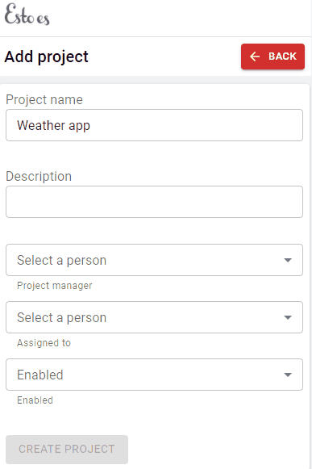
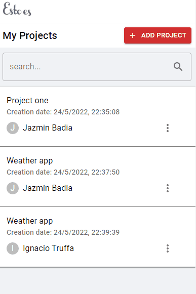
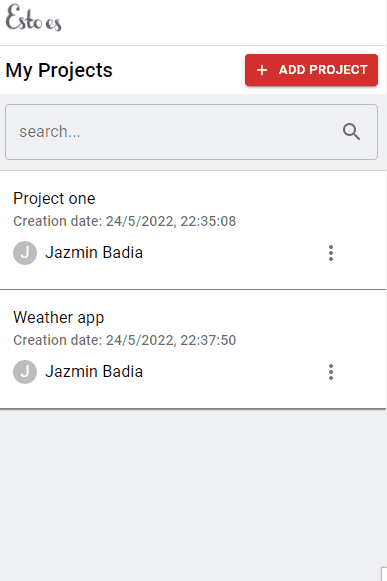
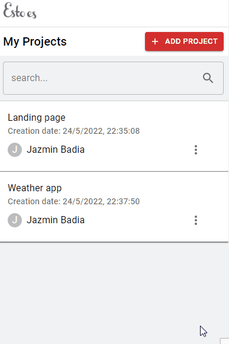

# Gestión de proyectos 📝

El usuario accede a un administrador de proyectos para realizar la gestión, puede crearlos, editarlos y eliminarlos.
Las tecnologías utilizadas fueron: ReactJs + Material-UI

## Creación

Es una plataforma simple con varios inputs donde deberemos de llenarlos todos para poder cargar el ítem.

## Eliminar y editar

Estos proyectos pueden tanto eliminarse como editarse en caso de que queramos corregir algo.

## Filtro de búsqueda

Como plus, se le agrega un buscador por nombre de proyecto.

